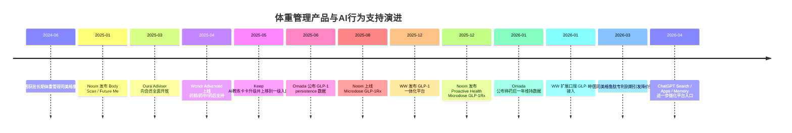
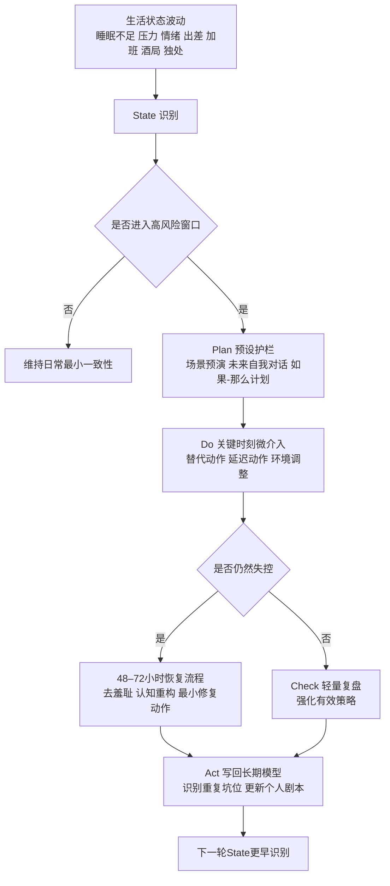

# Voliti 竞品格局深度研究报告

## 执行摘要

这份报告把 Voliti 所处的赛道定义为：**不是“告诉用户该怎么减脂”的工具赛道，而是“帮助已经知道该怎么做的人，在真实生活里把行为守住”的行为教练赛道**。按照这个标准，当前市场上真正接近 Voliti 的，并不是大多数热量记录、AI 营养建议或健身计划生成器；更接近的是那些把**行为改变本身**做成产品骨架、并开始围绕 **GLP-1/医疗减重前中后阶段**重写产品叙事的玩家。过去 18 个月里，entity["country","美国","north america"]这条线已经明显成型，代表是以行为科学和持续陪伴为底层的 Noom、Lark、Omada、Wondr，以及正在把 GLP-1 管理包进行为支持里的 WW；而在 entity["country","中国","east asia"]，主流供给仍主要停留在课程、记录、社区、食物数据库和运动计划，真正把“失控前预防—失控后 48–72 小时恢复—跨时间模式识别”做成主引擎的规模化产品，公开资料里基本还没有出现。citeturn36search2turn36search13turn36search14turn34search1turn34search16turn26search14turn26search3turn18search6turn37search2turn38search0turn39search0turn39search1

如果只看“谁最像 Voliti”，当前最值得盯的不是所有减肥 App，而是三类玩家。第一类是**行为骨架型**：Noom、Lark、Omada、Wondr。这类产品的核心不是一个 meal log 或 workout plan，而是持续行为干预、依从性、复盘与长期结果。第二类是**行为层被重新包装进 GLP-1 的平台型玩家**：WW、Found、Hims、Ro。它们现在的危险不在于“更懂行为”，而在于它们已经占住了药物、支付、医生、品牌和用户获取入口，一旦把行为支持做深，就会迅速侵入 Voliti 最核心的价值区。第三类是**安静但潜在破坏力极强的替代方案**：Oura 和 ChatGPT 这一类“状态感知 + 私密对话”的组合。它们今天还不是专门的 fat-loss behavior coach，但已经占住了 Voliti 最关键的两个前置条件：**高频低摩擦使用**与**低评判私密交互**。citeturn28search3turn28search13turn28search17turn29search1turn29search2turn6search0turn6search2turn6search3turn0search0turn0search1turn35search5turn35search6turn20search2

对 Voliti 来说，最大的白空间不是“再做一个更智能的减脂 App”，而是把**复原**做成主场景：当用户已经破功、已经吃乱、已经几天没练、已经开始自责时，现有产品大多不是回到继续记录、继续打卡，就是把人导向社区或课程；真正能在 **48–72 小时**内完成非评判式复盘、情境归因、认知重构、下一次防线重设，并把这次事件写回长期行为模型里的产品，公开可见的并不多。最大的红海，则是任何把 Voliti 做成“带聊天框的记录工具”“带关怀语气的 AI 营养师”“接 GLP-1 后的陪聊工具”的方向，因为这些能力已经被现有大平台和通用 AI 快速商品化。citeturn14search13turn34search16turn37search8turn39search0turn28search14turn29search1turn6search3

为避免把事实与推断混在一起，下面报告中凡涉及**产品上线时间、定价、订阅人数、用户数、功能声明、财报/融资/官方新闻**，都按事实处理并给出来源；凡涉及**“谁更接近 Voliti”“谁只是邻近玩家”“未来 12–24 个月谁会变危险”**，都明确作为基于事实的判断来写。citeturn37search1turn22search0turn27search1turn39search0turn29search2

## 赛道定义与判断标准

Voliti 要切入的不是传统“减重信息服务”市场，而是更窄、也更难的一条线：**fat-loss behavior execution**。如果用你的 S‑PDCA 框架来拆，真正相关的产品必须至少在以下几个节点有系统能力，而不只是给出一次性答案：

- **State**：识别疲劳、压力、孤独、出差、加班、应酬、独处放松等“容易失控的状态”。  
- **Plan**：在高风险情境前生成可执行的预案，而不是泛泛的“注意控制饮食”。  
- **Do**：在关键时刻给微动作支持，而非事后说教。  
- **Check**：失控后低评判复盘，区分一次偏离和连续崩盘。  
- **Act**：把单次事件沉淀成长期模式，并更新下一轮防线。  

把 Voliti 的五个优先级映射到这个框架，可以得到一个很清晰的行业判断：**绝大部分产品在 Plan/Do 上最强，少数产品在 Check 上开始成熟，而真正稀缺的是 State 和 Act。** 换句话说，行业里已经有很多产品会“给方案”，也有越来越多产品会“做记录”和“做趋势”；但真正能在用户还没失控前识别风险、在失控后快速带回轨道，并且跨几周几个月识别“你总是在同一种情境里掉坑”的，公开资料里仍然稀少。这个缺口，正是 Voliti 的核心战略价值。citeturn34search16turn26search3turn28search3turn36search2turn37search8turn39search0turn38search0

基于这个标准，本文把玩家分为三层。**直接竞品**，是那些把持续行为改变做成产品主骨架，而不是附属模块的产品；**相邻竞品**，是用户在减脂旅程中常常会替代使用，但其产品核心其实是记录、课程、社区、医生或药物获取；**替代方案**，则是不以减脂为名，但在“私密对话、状态感知、低评判陪伴、答案获取”上，已经开始吞噬用户时间和注意力的系统。这个划分非常重要，因为 Voliti 真正要防的，不只是“另一个减脂 App”，而是**更早进入用户心智和日常触点的产品**。citeturn29search1turn29search2turn25search4turn6search0turn6search3

## 中美竞争格局与演进

### 美国市场

事实层面，过去两年美国赛道的主旋律不是“更多人知道怎么减脂”，而是**GLP-1 让行为支持从可选项变成了必要的补充层**。Noom 在 2025 年 1 月推出了基于手机 10 秒扫描的个性化健康报告和 “Future Me” 可视化身形预测；2025 年 8 月推出 Microdose GLP‑1Rx，12 月又把微剂量 GLP-1、居家生物标志物检测和行为改变计划打包为 Proactive Health。Omada 在 2025 年 6 月公布 GLP‑1 持续用药与更高减重相关的数据，2026 年 1 月进一步公布 12 个月持续用药和停药后维持结果，并在 2026 年继续推进 GLP‑1 Flex Care。WW 则在 2025 年 12 月正式把自己改写成“GLP-1 时代的一体化平台”，到 2026 年初进一步把新的口服 GLP-1 接入 Med+，并持续强调结构化行为支持带来的增量结果。Wondr 在 2025 年 4 月推出 Wondr Advanced，明确以“药前、药中、药后”的体重管理支持作为新卖点。citeturn36search2turn36search13turn36search14turn26search1turn26search3turn26search5turn37search2turn37search6turn18search6

判断层面，这意味着美国直接赛道已经从“行为改变 vs 药物”转向“**行为改变如何嵌入药物旅程**”。也就是说，Voliti 如果进入美国市场，面对的不是 2021 年那种以热量记录、训练计划和社区减肥为主的格局，而是一个已经被重新定义的竞争环境：**谁能提高坚持率、减少副作用带来的退出、保护停药后的成果、帮助用户在真实生活里“带着药也能活得稳”**，谁就更接近新的主流叙事。对 Voliti 有利的是，这个叙事正在抬高“恢复”“维持”“依从性”“情境支持”的价值；对 Voliti 不利的是，大玩家已经开始把这些词写进营销文案，并用药物入口和支付能力来压缩独立行为产品的生存空间。citeturn26search3turn37search1turn37search9turn18search6turn0search1

更深一层的变化，是通用 AI 正在抢走“问问题”和“求建议”的第一入口。KFF 在 2026 年 3 月的调查显示，约三分之一美国成年人在过去一年用过 AI 聊天机器人获取健康信息或建议；65% 的用户说“快速、即时回答”是重要原因，36% 说更愿意私密地查询健康问题。Gallup/West Health 在 2026 年 4 月的调查又显示，近 25% 的美国成年人在过去 30 天使用过 AI 获取健康信息；其中 59% 的近期用户会问营养或运动问题，61% 最常用的是 ChatGPT、Copilot 这一类通用对话 AI，而不是垂类健康应用。与此同时，OpenAI 已把 ChatGPT Search 面向所有登录用户开放，并继续扩展 Memory 与 Apps in ChatGPT。citeturn29search2turn29search1turn6search0turn6search2turn6search3

这对 Voliti 的含义非常直接：**“给建议”会快速商品化，“记住你、理解你、在你最容易失控的那 20 分钟里把你拉回来”才会越来越值钱。** 如果 Voliti 做成的是一个比 ChatGPT 更懂减脂知识的聊天机器人，它会被平台层压扁；如果 Voliti 做成的是一个能记住用户几个月来的失控模式、懂得在加班夜、出差日、酒局前和独处刷剧时介入的执行系统，它才是在做平台还没有标准化抽象掉的能力。citeturn6search2turn6search3turn29search1

### 中国市场

事实层面，中国过去两年的变化与美国不同：**药物催化存在，但产品供给还没有真正完成“行为支持重写”。** 一方面，entity["company","诺和诺德","pharma denmark"]在 2024 年 6 月宣布用于长期体重管理的司美格鲁肽注射液诺和盈在中国获批；媒体在 2025 年 1 月报道，entity["company","礼来","pharma us"]的替尔泊肽（穆峰达）在中国上市并覆盖减重适应症；2026 年 3 月又有媒体报道，司美格鲁肽在中国的专利保护到期，价格竞争预期明显升温。另一方面，消费者日常接触到的主流产品，仍主要是 Keep、薄荷健康、咕咚这样以运动课程、数据记录、食物数据库、减脂打卡或平台型社区为核心的产品。citeturn30search0turn30search1turn30search2

这意味着中国市场今天更接近**“需求已在，品类未命名”**。Keep 的公开文案已经把 AI 教练卡卡推到一级页面，强调图片识别、语音指导、实时心率、HRV、饮食记录和多模态运动计划；薄荷健康则把 AI 体重管理工具、专家减重指导、食物数据库、记录与社区打包在一起；咕咚仍主要是运动赛事和一站式运动平台。它们都覆盖到了“减脂”或“体重管理”的一部分，但公开功能里，仍很少看到“高风险时刻预警”“失控后 48–72 小时复原”“同类行为坑的长期模式识别”被做成主场景。citeturn38search0turn38search1turn39search0turn39search1turn39search2

判断层面，中国并不是没有竞争，而是**竞争还没有聚焦到 Voliti 真正重视的问题上**。今天的大多数中国玩家，仍在争“更全的数据”“更方便的记录”“更强的课程供给”“更大的社区”“更高的内容密度”。这意味着 Voliti 在中国的最大机会不是比别人“更懂减脂原理”，而是重新定义问题本身：**你不是不会减，你是总在真实生活里失守；你不是缺方法，你是缺一个能在关键时刻守住一致性的系统。** 如果这个命题被验证，中国大平台当然也能跟进，但它们的现有产品结构、内容组织和商业模式，短期内并不天然适合围绕“失败后的复原”来重写主流程。citeturn38search0turn39search0turn39search1

### 产品与 AI 演进时间线

下面这条时间线只放与 Voliti 判断最相关的节点：**体重管理药物可及性变化、行为支持与 AI 的重写、以及通用 AI 变成健康建议入口**。节点来源见时间线后的事实说明。citeturn30search0turn36search2turn28search13turn18search6turn38search1turn26search1turn36search13turn37search2turn36search14turn26search0turn37search6turn30search2turn6search0turn6search3

从演进方向看，未来 12–24 个月最可能发生的不是“再多一些 AI 文案”，而是三件更实质的事。第一，**药物前后支持将成为标准配置**：不只是用药期间的副作用和蛋白摄入，连停药后的体重维持、依从性和肌肉保护也会被纳入主流叙事。第二，**状态感知会前移**：睡眠、压力、饮食时机、活动变化等数据会越来越多地被用来定义“你今天是不是容易破功”。第三，**答案入口平台化**：OpenAI 一类通用 AI 会把“问一问”和“写个计划”吸走，垂类产品只能在记忆、行为模型、结构化干预与执行结果上建立新的护城河。citeturn26search3turn37search9turn28search17turn28search11turn6search0turn6search2turn6search3

## 核心玩家矩阵与逐一解剖

下表中，**“类别归属、前防/后复/跨时/私密/低评判、AI 成熟度”属于基于公开功能与定位的判断**；**总部地、产品本质、变现和关键日期**为事实。若官方未明确披露，则写“未披露”。“前防”指失控前预防，“后复”指失控后 48–72 小时复原能力，“跨时”指长期模式识别。citeturn36search2turn34search16turn26search3turn28search3turn39search0

| 名称 | 总部地 | 类别 | 产品本质 | 前防 | 后复 | 跨时 | 私密 | 低评判 | AI成熟度 | 变现 | 2023–2026 关键变化 |
|---|---|---|---|---|---|---|---|---|---|---|---|
| entity["company","Noom","digital health us"] | 美国 | 直接 | 面向消费者的心理学驱动减重/whole-health 平台，正被 GLP-1 重写 | 部分：有行为指导，但公开“风险窗口识别”有限 | 部分：有陪伴与课程，但公开 48–72h 复原协议不强 | 是：Body Scan、长期趋势、课程持续性较强 | 是：App 私密性高 | 是：官方强调“不带压力和羞耻” | 中：AI 可视化与报告强，但公开个体化行为建模仍有限 | 订阅 + Med/GLP‑1 计划 | 2025-01 推 Body Scan/Future Me；2025-08 推 Microdose GLP‑1Rx；2025-12 推 Proactive Health；官方 AI 助手公开边界仍较浅。 citeturn36search2turn36search13turn36search14turn14search13turn12search8 |
| entity["company","Lark","digital health us"] | 美国 | 直接 | AI 原生的 24/7 数字健康教练，偏 payer/employer | 是：数据监测 + 24/7 coach + 实时跟踪 | 部分：持续陪伴强，但公开“复原剧本”不突出 | 是：LLM 个性化会随输入累积深化 | 是：文本式、私密 | 是：官方强调 compassion | 高：AI+行为科学+设备/吃动数据，公开有 LLM 个性化 | B2B2C，常由保险覆盖，个人端常见 $0 | 2023-09 扩展 GLP-1 Companion；2024-09 Coach+ 接入 LLM；官网称已赋能 200 万+患者。 citeturn34search0turn34search1turn34search2turn34search4turn34search16turn34search18 |
| entity["company","Omada Health","virtual care us"] | 美国 | 直接 | AI 增强的慢病/体重健康平台，强调人+AI+连接设备 | 是：设备、团队和 AI 增强体验共同作用 | 是：对停药后维持和长期恢复最接近 Voliti 逻辑 | 是：停药后一年维持是其公开强项 | 是：私域 care team 关系强 | 中高：不是“温柔陪聊”，但相对低评判 | 中高：AI 增强明显，但核心仍是 care team + 数据 | B2B2C，常由雇主/保险覆盖 | 2025-06 公布 persistence 数据；2026-01 公布 12 个月减重与停药后维持；2026 年将推出 GLP‑1 Flex Care；招股书披露截至 2024 年末累计成员超 67.9 万。 citeturn26search1turn26search3turn26search5turn26search6turn22search0turn26search14 |
| entity["company","Wondr Health","weight health us"] | 美国 | 直接 | 行为技能为核心的体重管理平台，AI 并不突出 | 部分：擅长技能训练，不擅长实时预警 | 部分：药前/药中/药后支持在加强 | 是：长期维持和 engagement 较强 | 中：更像项目型而非私人对话型 | 是：非极端、非惩罚式 | 低：公开 AI 能力弱，行为逻辑强 | 雇主/健康计划 | 2025-04 推 Wondr Advanced，支持用药前中后；官网强调 1 年约 10% 平均减重和 84.4% 参与度。 citeturn18search0turn18search2turn18search4turn18search6 |
| entity["company","WeightWatchers","weight management us"] | 美国 | 相邻 | 经典行为减重品牌，正在重构为 GLP‑1 一体化平台 | 部分：有结构化行为支持，但更偏 program | 部分：侧重副作用、剂量与依从性，不是情境复原 | 是：对 12 个月结果持续跟踪 | 中：私密性尚可，但社区是品牌核心之一 | 中：支持性强，但历史包袱与“被管理感”也强 | 中：AI body/food scanner 已上，但主干仍是 program+community | Core / Core+ / Med+，口服 GLP‑1 等 | 2023-12 推 GLP‑1 Success Program；2025-12 发布一体化 GLP‑1 平台；2026-03 披露 280 万订阅者、13 万 Clinical 订阅者；口服方案起价 $149/月。 citeturn37search4turn37search2turn37search1turn37search6turn37search8turn37search9turn37search0 |
| entity["company","Found","weight care us"] | 美国 | 相邻 | 远程医疗体重管理订阅，核心是“医生+药物+教练”通路 | 部分：有 1:1 教练，但实时情境预警弱 | 部分：支持不弱，但明确复原设计不公开 | 部分：有评估和持续追踪，但模式识别不是卖点 | 是：异步私密咨询强 | 中：更温和，但核心仍是 care plan | 中低：公开 LLM/行为建模不强 | 保险价可低至 $17/月；现金计划等 | 2025 年新版条款明确将 compounded GLP‑1、branded GLP‑1、generic oral meds 分 plan 管理；公开月订阅常见 $129，另有 $39 评估试用。 citeturn35search5turn35search6turn35search9 |
| entity["company","Keep","fitness app china"] | 中国 | 相邻 | 大型运动社区/课程平台，AI 教练把运动与数据整合得更强 | 部分：有心率/HRV/数据整合，但偏训练而非“失控情境” | 否：公开重心不在复原 | 是：All-in-one 数据长期记录能力强 | 中：可私用，但社区/分享很强 | 中：语气更温和，但动机结构仍是课程+挑战 | 中：多模态、图像识别、语音指导、运动垂模 | 会员月 19 元、季 58 元、年 218 元 | 2025-05 AI 教练卡卡大升级并前置到一级页面；App Store 文案称“4 亿运动爱好者”，并接入心率、HRV、食物拍照记录。 citeturn38search0turn38search1 |
| entity["company","薄荷健康","weight app china"] | 中国 | 相邻 | 中国食物数据库 + 体重管理 + 商城 + 社区的综合平台 | 部分：有 AI 体重管理工具，但更偏管理工具 | 否：公开核心不在“复原” | 是：体重/体脂/围度等长期记录较强 | 是：默认关闭 HealthKit 分享，隐私表述比多数同类更明确 | 中：有陪伴，也有打卡与挑战 | 中低：AI 在工具层，行为建模公开有限 | 部分功能付费会员 + 商城 | App Store 文案称 17 年积累、1 亿+用户、100 万+食物数据库，并默认关闭 HealthKit 相关新工具。 citeturn39search0 |
| entity["company","咕咚","fitness app china"] | 中国 | 相邻/替代 | 一站式运动、赛事、跑步骑行平台 | 否：不是主场景 | 否：不是主场景 | 部分：有长期运动历史 | 中：可私用，但偏平台/赛事 | 中：不强评判，但更偏表现和参与 | 低中：AI 标签存在，行为教练深度弱 | 会员/赛事/平台生态 | App Store 文案称“2 亿人都在用”，更新节奏集中在赛事、分享模板、虚拟玩偶等平台功能。 citeturn39search1turn39search2 |
| entity["company","Oura","wearable health finland"] | 芬兰/美国 | 替代 | 可穿戴状态感知层，正在长出 AI 健康伴侣 | 是：睡眠、压力、Meals、Advisor 与预警能力正变强 | 部分：可给恢复建议，但不是减脂复盘引擎 | 是：公开强调 short- and long-term data | 是：高度私密，一对一 | 是：官方强调 holistic、compassionate approach | 高：LLM + 长短期数据 + Meals + Health Panels | 硬件 + 会员 $5.99/月或 $69.99/年 + Labs | 2025-03 Advisor 向所有会员开放；2025-11 扩展到睡眠趋势、活动变化和饮食洞察；会员定价公开透明。 citeturn28search13turn28search3turn28search17turn28search0turn28search12 |
| ChatGPT | 全球 | 替代/平台 | 通用对话 AI，正在吞噬“搜索+问答+轻方案”入口 | 部分：可做预案，但默认不具备被动风险侦测 | 是：极强的对话式复原潜力，但依赖用户主动触发 | 部分：Memory 在增强，但不是专门行为模型 | 是：极强私密性 | 是：默认低评判 | 高：LLM、搜索、记忆、Apps 平台化 | 免费 + 订阅 + Apps 生态 | 2025–2026 Search 面向登录用户开放；Memory 强化；Apps in ChatGPT 上线。2026 年调查显示，美国近期用 AI 获取健康信息的人里，59% 问过营养/运动，61% 用的是通用对话 AI。 citeturn6search0turn6search2turn6search3turn29search1turn29search2 |

### 最该盯住的直接玩家

**Noom** 是目前最像“消费级行为产品”的直接玩家，但它的本质正在变化。事实是，它仍然拥有心理学和行为改变的品牌资产，也在通过 Body Scan / Future Me、Microdose GLP‑1Rx 与 Proactive Health 把 whole-health 和药物支持整合进来；但它公开的 AI 能力边界也很清晰，Welli 不能基于用户的年龄、体重、医学史和个人目标提供真正个体化建议，这说明 Noom 的 AI 目前更像交互层和解释层，而不是一个深度行为模型。我的判断是：**Noom 是 Voliti 当前最接近的消费品牌参照，但仍未把“失控前/后关键时刻干预”做成主引擎。** 它强在行为叙事和品牌，弱在状态前摄与复原专门化。citeturn36search2turn36search13turn36search14turn14search13turn12search8

**Lark** 和 **Omada** 更危险的地方不在于“像不像一个好用的 consumer app”，而在于它们已经把行为改变放进了医疗/支付体系。Lark 公开强调 24/7 数字教练、行为科学和 CBT、LLM 个性化及 200 万+患者规模，Omada 则拿出 GLP‑1 持续用药、停药后维持、AI 增强体验和累计 member 规模的数据。我的判断是：**这两类玩家证明了行为支持在 GLP‑1 时代是“可以被买单”的，但它们的主战场更偏企业、保险和临床通路，而不是情绪脆弱、羞耻敏感、想低调自救的白领个体。** 这给 Voliti 留出的不是“更懂医学”的空间，而是“更懂真实生活里的人”的空间。citeturn34search1turn34search2turn34search16turn34search18turn26search3turn26search6turn22search0

**Wondr** 是容易被忽视但不能低估的玩家。它不像 Noom 那样品牌化，也不像 Omada/Lark 那样科技感强，但它非常清楚地站在“行为技能”“维持”和“药前药后支持”上。判断上，我会把它看成一个**最接近“把行为改变做成骨架、但没有把 AI 做成产品叙事中心”的对照组**。这对 Voliti 很重要，因为它提醒你：真正对你有威胁的，不一定是最会说 AI 的人，而可能是那些更早把“人的行为为什么总会跑偏”拆清楚的人。citeturn18search0turn18search2turn18search4turn18search6

### 看起来像竞品，但本质上不是

首先，**AI 热量记录/食物识别/饮食建议型产品**并不是真正的直接竞品。像 MyFitnessPal 这类产品的核心单位，是“记录一餐、算一次摄入、看一次趋势”，不是“在你想暴食前 15 分钟把你拉住，或在破功后的第二天让你不继续沉下去”。即便它们在 2026 年加入照片上传、语音记录等 AI 功能，核心仍是**输入与计算效率**，而非**行为脱轨管理**。所以它们会争走用户的记录时间，但未必能直接满足 Voliti 的核心 job-to-be-done。citeturn19search0turn19search1

其次，**中国的 Keep、薄荷健康、咕咚**也更像邻近玩家而非直接对手。Keep 的产品核心仍是运动课程、挑战赛、数据整合与 AI 运动教练；薄荷仍是中国饮食数据库、体重管理工具、商城与社区的复合体；咕咚更偏一站式运动与赛事平台。它们都能覆盖“我在减脂”这一大盘需求，但还没有把“我为什么总在某种时刻做不到”变成产品中心问题。**这不是说它们不危险，而是说它们今天危险的方式主要是流量、品牌、内容和数据，不是行为教练骨架。**citeturn38search0turn39search0turn39search1

第三，**Hims、Ro 这一类远程医疗平台**很容易被误判成 Voliti 的正面竞品。其实它们今天的产品本质是“拿药和医疗接入更方便”，不是“把知行差距管理得更细”。Hims 的官方叙事已经明确把 weight-loss 变成“药物 + 临床支持 + 营养/睡眠/运动建议”的整体方案，并与 Novo 建立合作，但其主价值仍是渠道、规模、定价与临床可达性，而不是细颗粒度的行为复原。它们是**高风险替代方案**，不是当前最纯粹的直接竞品。citeturn0search0turn0search1turn0search2turn20search2

### 未来十二到二十四个月最可能变成真威胁的玩家

**Oura** 是我认为最值得警惕的“非减脂 app 型威胁”。事实是，它已经有 LLM 驱动的 Advisor、短期与长期数据、Meals、饮食洞察、压力/睡眠/活动趋势，以及会员付费模型。判断上，只要它再往前迈半步——比如把 weight-health、社交情境、疲劳诱发饮食、停药后维持做成明确工作流——它就会非常接近 Voliti 的 State Before Strategy 理念。因为 Oura 已经拥有 Voliti 最难从零建立的部分：**高频状态数据、用户长期信任、持续输入习惯和私密交互语境。** citeturn28search3turn28search11turn28search17turn28search19turn28search12

**ChatGPT** 也是巨大的结构性威胁。它今天的问题在于不垂直、不被动、不专门；但它的优势在于**用户已经在里面问问题、搜索、反思、倾诉，而且越来越愿意上传个人信息以获得更个体化解释**。KFF 和 Gallup 的最新调查都说明，这个迁移正在发生。再加上 Search、Memory、Apps in ChatGPT，平台层非常有可能在未来 12–24 个月里把“减脂行为支持”吸纳成某种轻应用或插件能力。Voliti 唯一的应对方式不是和它拼通用对话，而是建立**面向 fat-loss execution 的专属事件模型、复原流程和结果证据**。citeturn29search1turn29search2turn6search0turn6search2turn6search3

**WW、Noom、Hims、Ro 这类拥有药物入口或强品牌入口的平台**，则代表另一种威胁：它们会把行为支持“捆绑”进去，而不是单独卖。WW 已经明确宣称结构化行为支持能给 GLP‑1 结果带来额外增益；Noom 已经在 whole-health + microdose + biomarker 的方向下注；Hims 与 Novo 的合作则说明渠道方和药企正在一起思考“如何改善长期结果”。如果 Voliti 未来想做 GLP‑1 用户的行为层，就必须假设这条赛道会非常快地红海化。citeturn37search1turn37search6turn36search14turn0search1

在中国，**Keep 和薄荷健康**是最可能从邻近变成近威胁的两家。原因不在于它们今天已经很像 Voliti，而在于它们已经拥有最难复制的东西：用户体量、中文语料、付费关系、体重/饮食/运动数据和品牌信任。一旦它们把 AI 从“课程与记录的加速器”转向“行为脱轨预警与复原引擎”，跟进速度可能会很快。Voliti 在中国的时间窗口，恰恰来自于这种重写尚未发生。citeturn38search0turn38search1turn39search0

## 影响用户心智的人与渠道

### 领域意见领袖与他们正在塑造的叙事

下面的“影响力”分为**事实**和**判断**两层：粉丝/订阅量与身份为事实；“其叙事如何影响用户心智”是基于其公开内容方向的判断。

| 人/机构 | 市场 | 公开触达信号 | 主要叙事方向 | 对 Voliti 的意义 |
|---|---|---:|---|---|
| entity["people","顾中一","nutrition writer china"] | 中国 | 微博约 628.8 万粉丝 | 证据导向、辟谣、反营养神话 | 代表中国城市用户对“科学减脂内容”的信任锚点；Voliti 内容调性应避免玄学和意志力说教。 citeturn10search0turn33search8 |
| entity["known_celebrity","刘畊宏","fitness creator china"] | 中国 | 抖音约 7370 万粉丝 | 可见的运动挑战、群体打卡、强行动召唤 | 影响巨大，但更偏“动起来就会瘦”的外显叙事，不等于行为复原。Voliti 可借势但不应复制。 citeturn10search2 |
| entity["people","周六野 Zoey","fitness creator china"] | 中国 | 抖音约 582.5 万粉丝 | 居家训练、可执行课程、女性友好健身 | 强在“开始做”，弱在“为什么总是断掉”。Voliti 能补上课程之外的执行心理层。 citeturn10search1 |
| entity["organization","丁香医生","health media china"] | 中国 | 抖音约 648.8 万粉丝 | 医学化、实用科普、健康消费决策解释 | 它代表了中国用户对“科学健康内容”的中枢媒体心智，也说明内容权威和转化并不矛盾。 citeturn33search2 |
| 范志红 | 中国 | 公开学术身份强，社媒总触达未统一披露 | 食品营养、反误区、日常饮食科学 | 影响的是“营养常识底盘”，但不直接解决执行断裂；更适合作为内容背书逻辑，而非增长主引擎。 citeturn33search0turn33search8 |
| entity["people","Andrew Huberman","neuroscientist podcaster"] | 美国 | YouTube 约 746 万订阅 | 睡眠、压力、习惯、神经科学解释框架 | 他把“瘦身”抬升成“表现/恢复/状态管理”，与 Voliti 的 State Before Strategy 高度同频。 citeturn8search1 |
| entity["people","Peter Attia","longevity physician"] | 美国 | YouTube 约 103 万订阅 | 长寿、代谢健康、长期风险管理 | 让高压白领把减脂理解为代谢健康工程，而非短期审美项目。Voliti 可借这套语言体系。 citeturn8search0 |
| entity["people","Mike Israetel","exercise scientist"] | 美国 | YouTube 约 384 万订阅 | 训练科学、减脂可持续性、体组成 | 把“结构化减脂”和“不要走极端”讲得很强，但仍偏训练与营养层，给 Voliti 留下行为执行层空间。 citeturn8search3 |
| entity["people","Layne Norton","nutrition scientist"] | 美国 | YouTube 约 43.6 万订阅 | 营养科学、反伪科学、长期一致性 | 其叙事强化“别被花哨方案骗”，适合 Voliti 做“不是更复杂，而是更稳”的定位。 citeturn32search0turn32search25 |
| entity["people","Jordan Syatt","fitness coach"] | 美国 | YouTube 约 24.7 万订阅 | 可持续减脂、关系式教练、非极端方法 | 很接近 Voliti 的“低评判教练关系”语感。 citeturn32search1turn32search22 |
| entity["people","Sohee Carpenter","fitness educator"] | 美国 | Instagram 约 67 万关注 | 现实主义健康、女性减脂、少做极端 | 对“不完美但持续”的表述非常强，这与 Voliti 的复原逻辑高度兼容。 citeturn32search3turn32search24 |
| entity["people","Spencer Nadolsky","obesity physician"] | 美国 | 医生品牌 + Docs Who Lift 播客 | 肥胖医学、GLP‑1 与生活方式并行 | 代表“药物不等于放弃行为”的关键声音，会直接影响肥胖/减重用户对行为支持是否必要的认知。 citeturn32search2turn32search6turn32search10 |

把这些意见领袖放在一起看，可以得到一个重要结论：**中美用户心智都在从“多学一点减脂知识”转向两条分化路线。** 一条是证据主义——不再相信玄学偏方、神奇断食和单一宏量营养神话；另一条是状态主义——越来越多人开始把瘦不下来理解为睡眠、压力、环境和生活结构的问题，而不是单纯“自制力差”。Voliti 最应该借的，不是“7 天暴瘦”或“更狠的监督”，而是这两条路线交汇产生的一个新命题：**我不是缺知识，我是需要一套在坏状态里还能稳住行为的系统。** citeturn33search8turn8search1turn8search0turn32search10

### 用户触达渠道正在怎样变化

entity["organization","KFF","health policy us"]和 entity["organization","Gallup","polling firm us"]在 2026 年的调查已经非常清楚地说明了美国变化：AI 正变成健康建议入口，而不再只是搜索补充。KFF 显示，32% 成年人在过去一年用过 AI 获取健康信息或建议；原因里，65% 是为了快，36% 是为了更私密。Gallup/West Health 显示，过去 30 天里用 AI 获取健康信息的人中，59% 问过营养或运动，61% 用的是通用对话 AI。与此同时，entity["organization","OpenAI","ai lab us"]已经把 Search、Memory 与 Apps 逐步整合进 ChatGPT。判断上，这意味着美国用户的“发现—解释—轻决策”链路，正在从“Google → 博客/Reddit → App”变成“ChatGPT/AI → 若干链接/引用 → 再决定是否下载垂类产品”。citeturn29search2turn29search1turn6search0turn6search2turn6search3

在中国，可以看到的是另一种迁移：**搜索不再只发生在搜索引擎里，而是发生在内容社区和 AI 原生 App 里。** entity["company","QuestMobile","market research china"] 2026 年 3 月的年度报告显示，2025 年 AIGC/AI 原生 App 的总使用时长同比增长 176.7%。关于 entity["company","小红书","social app china"]，行业引用其官方通案的数据称，平台拥有约 3 亿月活、内容分享者超 1 亿、月均搜索渗透率达 70%；另有媒体引述其官方披露称，2025 年 1–11 月平台每天超 7000 万条评论、每月约 2 亿用户在小红书寻求购买建议。关于 entity["company","哔哩哔哩","video community china"]，公开报道显示 2025 年四季度 MAU 约 3.66 亿、DAU 1.13 亿、用户日均使用时长 107 分钟。另有 QuestMobile 口径显示，小红书和 B 站的一线/新一线用户占比分别约 37.2% 和 38.5%，30 岁以下占比也都明显更高。citeturn25search4turn25search2turn25search3turn24search11turn25search9

这组数据背后的判断是：对于 Voliti 这样的产品，**搜索引擎不再是唯一入口，甚至可能不是第一入口。** 中国用户会在小红书上先搜索“加班后暴食怎么办”“减脂一周崩两天怎么办”；在 B 站或公众号里寻找更系统的科学解释；然后越来越多地在 AI 机器人里追问“那我今晚到底怎么做”。美国用户则会更快地把第一轮问题直接扔给 ChatGPT，再去 YouTube、播客、Reddit 和垂类 app 验证。Voliti 如果还按传统 SEO 思路建设内容，只能吃到“冷知识需求”；如果转向 **AEO/answer-engine optimization + 情境化内容资产 + 可被 AI 引用的结构化案例**，会更贴合 2026 的用户路径。citeturn29search1turn29search2turn25search4turn25search2turn24search11turn6search0

### 对 Voliti 最值得投入的渠道组合

我的判断是，Voliti 的渠道不应该按“流量最大”来选，而应该按“**能否进入用户最脆弱、最私密、最需要不被评判的那个时刻**”来选。

在中国，最优先的是：
- **小红书**：因为它同时是问题发现、经验搜索和消费决策场，且搜索渗透高、城市白领密度高。Voliti 适合做“真实场景复盘”内容，而不是泛科普。citeturn25search2turn25search3turn25search9
- **B 站**：更适合中长内容、去羞耻解释、行为模式拆解、系列化案例。对 25–40 岁知识工作者中的理性用户特别重要。citeturn24search11turn25search9
- **微信私域**：作为转化和留存层最有价值，尤其适合“私密、低评判、连续陪伴”的关系维护；它不一定是第一触达，但很适合承接。  
- **AI 机器人内容占位**：包括国内主流 AI 助手和国际通用 AI。目标不是投广告，而是让你的方法论、案例和结构化知识成为 AI 常引用的材料。citeturn25search4turn6search3

在美国，最优先的是：
- **ChatGPT/AI 答案入口**：因为用户已经在这里问营养/运动和健康问题。Voliti 应该主动建设能被 AI 检索、引用和提炼的高质量公开内容。citeturn29search1turn29search2turn6search0
- **YouTube + 播客合作**：不是为了“流量泛曝光”，而是为了进入 Peter Attia、Huberman、Layne Norton、Jordan Syatt、Spencer Nadolsky 这些叙事场，借用他们已经塑造好的“长期一致性”“代谢健康”“药物+行为”心智。citeturn8search0turn8search1turn32search0turn32search1turn32search2
- **Reddit/社区型讨论场**：适合获取真实语言、羞耻点、失败模式和复原痛点；更适合研究与内容测试，不一定适合强转化。  
- **Instagram/TikTok**：适合作为“情境钩子”和创作者联动渠道，但不适合承载 Voliti 的全部解释任务。  

归根结底，Voliti 不应把自己当成“被用户主动搜索功能名的 App”，而要当成一种**被用户在某个时刻突然需要的行为救援系统**。这对渠道策略的含义是：公开渠道负责触发“这说的就是我”，私密渠道负责承接“我能不能先悄悄试一下”。citeturn29search2turn25search2turn24search11

## 对 Voliti 的白空间、红海与策略含义

### 最大白空间

最大的白空间不是“AI + 减脂”，而是**State-first 的私密复原系统**。现有产品大多把“用户已经想减脂”视为起点，于是产品重心放在计划、课程、记录、药物、知识或提醒上；Voliti 可以把起点改成另一句话：**“用户又要快撑不住了。”** 只要这个起点成立，产品就会自然长出和行业不同的骨架：高风险时刻识别、情境预演、未来自我对话、认知重构、最小恢复动作、48–72 小时纠偏、长期坑位识别。尤其在中国，这一块依然是明显的命名空白；在美国，这一块虽然已被 GLP‑1 companion 叙事部分触碰，但仍多停留在依从性和副作用管理，并没有完全走到具体生活场景里的逃逸与复原。citeturn26search3turn37search8turn38search0turn39search0

第二个白空间，是**“不是公开打卡，也不是社区互相监督”的私密陪伴**。KFF 的隐私动因、Gallup 的“感觉被医生忽视”动因，和中国用户在小红书/AI 里的匿名搜索行为放在一起看，都说明了一个问题：很多用户并不想把自己的失败、进食冲动、松懈、自责拿去公开展演，他们想要的是一个不会羞辱自己、也不要求自己表演“自律人格”的对象。Voliti 的低评判关系如果做得好，会天然区别于以社区、排名、挑战、成就展示为核心的很多现有产品。citeturn29search1turn29search2turn25search2turn25search3

第三个白空间，是**跨时间的行为模式资产**。行业里已经有很多“你的今天”，也已经开始有一些“你的趋势”；但少有产品真正把用户过去几个月在压力、疲劳、旅行、社交、独处等情境里的“失败剧本”和“成功剧本”结构化积累下来，并让下一次干预因此更准。这个积累，一旦做对，会比“知识更全”或“建议更多”更有壁垒，因为它是 Voliti 自己的数据与干预资产，而不是任何大模型都能即时生成的文本。citeturn28search3turn34search16turn26search3

### 最危险的红海

最危险的红海，是**GLP-1 伴随行为支持层**。这里已经聚集了 WW、Omada、Lark、Noom、Wondr、Hims、Ro 等不同类型的玩家，而且它们各自控制不同的关键资源：支付、医生、药物、企业客户、品牌、社区、数据。Voliti 一旦把自己定位成“GLP‑1 用户的 AI 教练”，短期可能能获得市场顺风，但中期会很容易被这些平台的捆绑式方案挤压。对于 Voliti，更好的做法不是回避药物用户，而是把药物视为一个可选模式：**服务“人在真实生活中如何稳住一致性”，而不是服务“药物本身”。** citeturn37search1turn37search6turn26search5turn34search1turn0search1

第二个红海，是**AI 记录与计划生成层**。无论是 Keep 的拍照记食物、MyFitnessPal 的照片/语音记餐，还是 ChatGPT 直接给出饮食建议与运动方案，这一层会变得非常便宜，且越来越被平台化。Voliti 如果在这里打，会进入一个没有强差异化、也很难建立品牌忠诚的市场。citeturn38search0turn19search0turn29search1turn6search3

第三个红海，是**“更温和一点的内容型减脂”**。因为科学减脂内容、低压力表达、真实案例分享，本身已经是主流意见领袖和平台型内容账号的基本功了。Voliti 不能只靠“说得更懂用户”来赢；必须把这种理解变成**用户在关键时刻真实感到不同的产品动作**。citeturn33search2turn10search0turn32search1turn32search3

### 对产品与 GTM 的具体含义

如果以上判断成立，Voliti 在产品上最该坚持的不是“功能更全”，而是**主流程更窄、更深、更反行业惯性**。一个值得坚持的产品路径是：不把首页做成日志、课程、食谱、体重图，而是做成**今天的状态、今天的风险、今天最小的护栏动作**；不把复盘做成“你昨天吃了多少”，而是做成“为什么你又是在这个情境里失手，下次要提前埋哪根钉子”；不把教练关系做成群体监督，而是做成一种**不会羞辱你、但也不纵容你继续滑坡**的合作关系。citeturn29search2turn29search1turn28search3turn34search16

在 GTM 上，Voliti 最强的叙事，不应该是“更科学地减脂”，也不应该是“AI 帮你吃得更准、练得更好”，而应该是下面这句更接近真实用户处境的话：**“你不是不知道怎么减，你是在某些时刻总守不住；Voliti 帮你把这些时刻一个一个守住。”** 这句话的好处在于，它天然避开了 Noom/WW/Keep/薄荷健康的主话术，也避开了 ChatGPT 式的“问我任何问题”。它切中的，是行业最难被商品化、但最容易被感知到价值的那一层。citeturn36search8turn37search1turn38search0turn39search0turn29search2

最后，用一张用户旅程与干预点图，把 Voliti 与主流产品的差异总结出来。图是方法论示意，不是对某一家产品的事实陈述。

把这张图和整个竞品格局放在一起看，结论其实很清楚：**Voliti 不该去争“谁更会减脂”，而该去争“谁更会把用户从反复的知行断裂里救出来”。** 这既是当前最大的空白，也是未来最有可能建立非对称优势的位置。